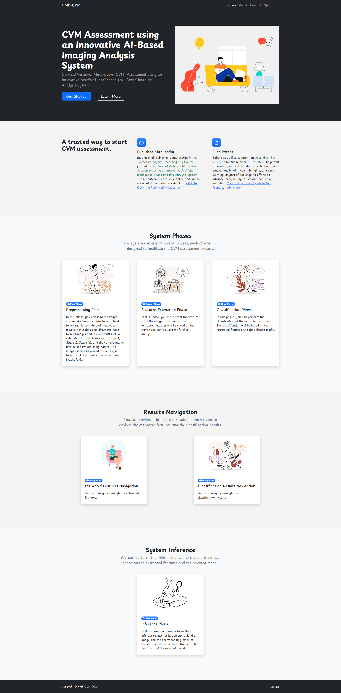
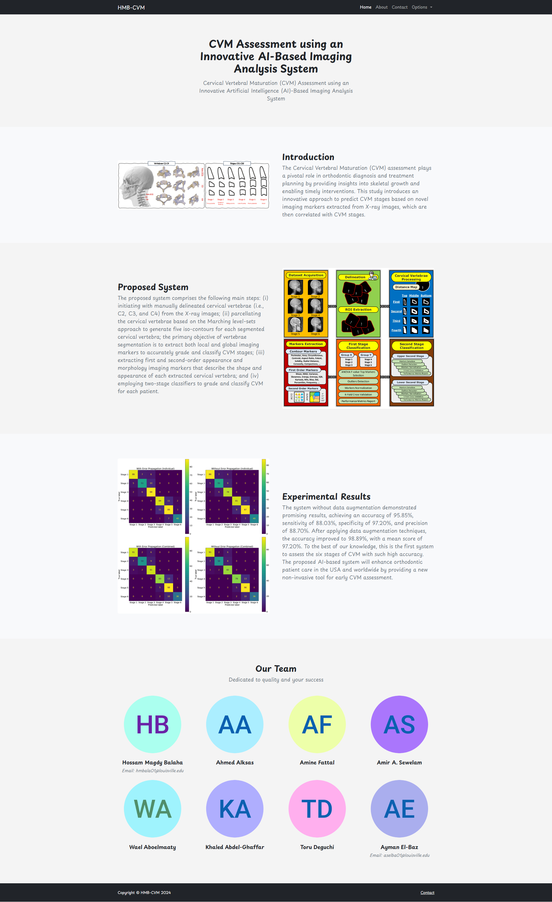

# Cervical Vertebral Maturation (CVM) Assessment using an Innovative Artificial Intelligence (AI)-Based Imaging Analysis System

## Publications and Authors

### Cervical Vertebral Maturation Assessment using an Innovative Artificial Intelligence-Based Imaging Analysis System

**Journal**: Biomedical Signal Processing and Control (Elsevier).

**Authors**: **Hossam Magdy Balaha**$^1$, Ahmed Alksas$^1$, Amine Fattal$^2$,
Amir A. Sewelam$^3$, Wael Aboelmaaty$^{4,5}$, Khaled Abdel-Ghaffar$^6$,
Toru Deguchi$^2$, and Ayman El-Baz$^1$.

$^1$ Bioengineering Department, J.B. Speed School of Engineering, University of Louisville, Louisville, KY, USA.
<br> $^2$ Department of Orthodontics, School of Dentistry, University of Louisville, Louisville, KY, USA.
<br> $^3$ Orthodontics Department, Faculty of Dentistry, Horus University, Egypt.
<br> $^4$ Wael Aboelmaaty: College of Dentistry, King Saud bin Abdulaziz University for Health Sciences, Riyadh, Saudi
Arabia.
<br> $^5$ Oral Radiology and Diagnostic Sciences, Faculty of Dentistry, Mansoura University
<br> $^6$ Khaled Abdel-Ghaffar: Oral Diagnosis and Periodontology, Faculty of Dentistry, Ain Shams University, Egypt.

**DOI**:

**Link**:

## Website Views

The website views of the project are shown in the following figures:

1. **Home Page**:

<div style="text-align: center;">
    <a href="./Visualization/1-Index.jpg" target="_blank">
        
    </a>
</div>

2. **About Page**:

<div style="text-align: center;">
    <a href="./Visualization/2-About.jpg" target="_blank">
        
    </a>
</div>

3. **Data Preprocessing Phase Page**:

<div style="text-align: center;">
    <a href="./Visualization/3-Data%20Preprocessing%20Phase.jpg" target="_blank">
        
    </a>
</div>

4. **Features Extraction Phase Page**:

<div style="text-align: center;">
    <a href="./Visualization/4-Features%20Extraction%20Phase.jpg" target="_blank">
        
    </a>
</div>

5. **Classification Phase Page**:

<div style="text-align: center;">
    <a href="./Visualization/5-Classification%20Phase.jpg" target="_blank">
        
    </a>
</div>

6. **Extracted Features Navigation Page**:

<div style="text-align: center;">
    <a href="./Visualization/6-Extracted%20Features%20Navigation.jpg" target="_blank">
        
    </a>
</div>

7. **Classification Results Navigation Page 1**:

<div style="text-align: center;">
    <a href="./Visualization/7-Classification%20Results%20Navigation-Closed.jpg" target="_blank">
        
    </a>
</div>

8. **Classification Results Navigation Page 2**:

<div style="text-align: center;">
    <a href="./Visualization/8-Classification%20Results%20Navigation-Opened.jpg" target="_blank">
        
    </a>
</div>

9. **Inference Phase Page**:

<div style="text-align: center;">
    <a href="./Visualization/9-Inference%20Phase.jpg" target="_blank">
        
    </a>
</div>

10. **Inference Phase (Prediction) Page**:

<div style="text-align: center;">
    <a href="./Visualization/10-Inference%20Phase-Prediction.jpg" target="_blank">
        
    </a>
</div>

## Major Packages Used

1. **albumentations**: A fast and flexible library for augmenting images, useful for image preprocessing and data
   augmentation in computer vision tasks.

2. **flask**: A lightweight WSGI web application framework that is commonly used to build web applications and APIs in
   Python.

3. **lightgbm**: A highly efficient and fast gradient boosting framework that is widely used in machine learning for
   classification and regression tasks.

4. **mahotas**: A computer vision and image processing library that offers advanced functions for morphological
   operations, filtering, and image analysis.

5. **matplotlib**: A comprehensive library for creating static, animated, and interactive visualizations in Python. It
   is widely used for plotting and data visualization.

6. **numba**: A just-in-time (JIT) compiler that translates a subset of Python and NumPy code into fast machine code for
   performance improvement.

7. **numpy**: A fundamental package for scientific computing in Python, particularly for working with arrays and
   matrices of numeric data.

8. **opencv-python**: OpenCV (Open Source Computer Vision Library) provides powerful tools for computer vision,
   including real-time image processing, object detection, and face recognition.

9. **pandas**: A powerful data manipulation and analysis library that provides data structures like DataFrames, which
   are essential for handling and analyzing structured data.

10. **plotly**: An interactive graphing library that supports a wide variety of chart types and is commonly used for
    creating interactive and dynamic visualizations.

11. **scikit-learn**: A popular machine learning library in Python that provides simple and efficient tools for data
    mining, data analysis, and machine learning algorithms.

12. **scikit-image**: A collection of algorithms for image processing in Python, useful for tasks like segmentation,
    filtering, and object recognition.

13. **scipy**: A scientific and technical computing library for Python that builds on NumPy and provides functions for
    optimization, integration, interpolation, and more.

14. **seaborn**: A Python visualization library based on matplotlib that provides a high-level interface for creating
    attractive and informative statistical graphics.

15. **xgboost**: An optimized gradient boosting machine learning library designed to be efficient, flexible, and
    portable, widely used in regression and classification problems.

16. **pyod**: A comprehensive Python toolkit for detecting outliers in multivariate data.

## Installation Instructions

To install the environment, follow these steps:

1. Install [Miniconda](https://docs.conda.io/en/latest/miniconda.html)
   or [Anaconda](https://www.anaconda.com/products/distribution) on your system.

2. Save the provided environment YAML file as `environment.yml`.

3. Open a terminal or command prompt and navigate to the directory where the `environment.yml` file is saved.

4. Run the following command to create the environment:
   > conda env create -f environment.yml

   This command will create a new environment named cvm with all the specified dependencies.

6. Activate the environment by running the following command:
   > conda activate cvm

7. Once activated, you can verify the installed packages with:
   > conda list

8. To deactivate the environment, you can run:
   > conda deactivate

## Citations

If you find this project useful in your research or projects, please consider citing the following paper:

```bibtex
```

## Licence

No part of this project may be reproduced, distributed, or transmitted in any form or by any means, including
photocopying, recording, or other electronic or mechanical methods, without the prior written permission of the 
first author (and/or corresponding author), except in the case of brief quotations embodied in critical reviews 
and certain other noncommercial uses permitted by copyright law.

This means that you are not allowed to use this project for commercial purposes, and you are not allowed to share it
with others without the prior written permission of the first author.

In case you would like to use this project for commercial purposes or share it with others, please contact the first
author (and/or corresponding author) to obtain the required permissions.

## Contact

For any questions or inquiries, please contact `Hossam Magdy Balaha` using the contact information available on
my CV at the following link: https://hossambalaha.github.io/
